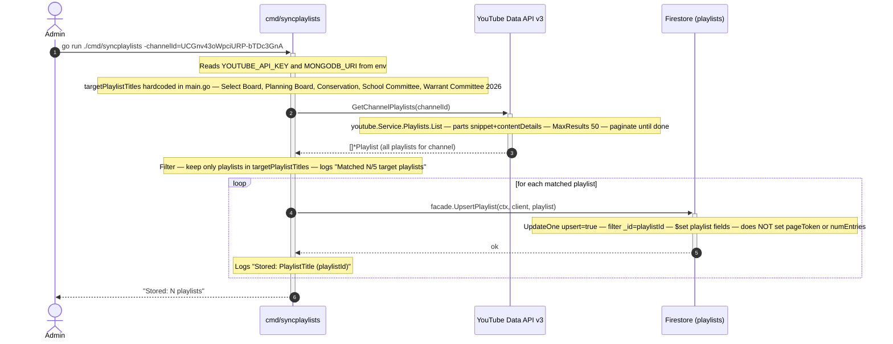
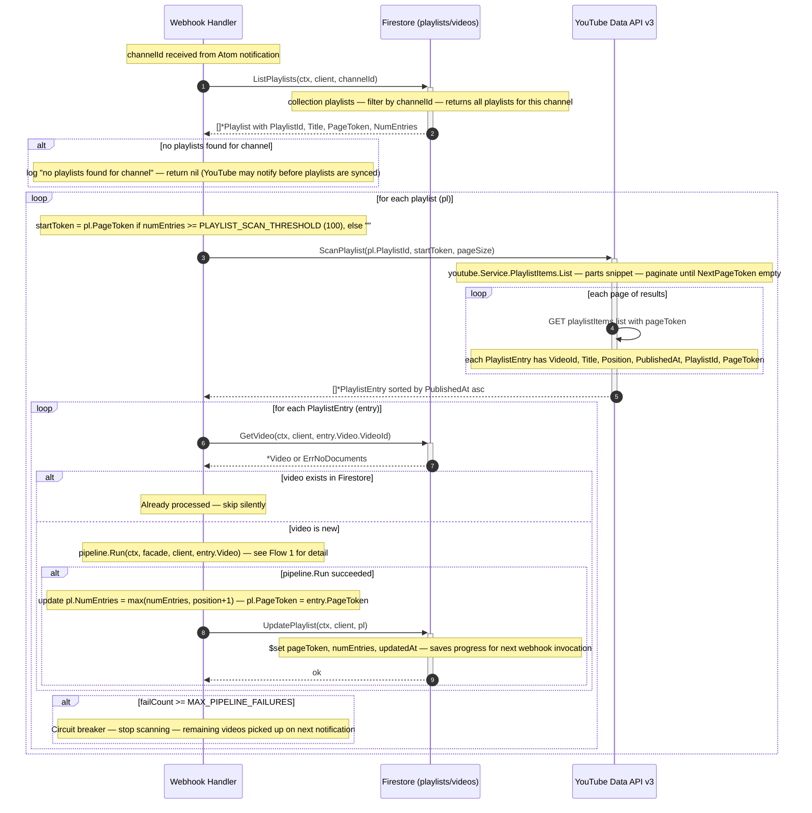
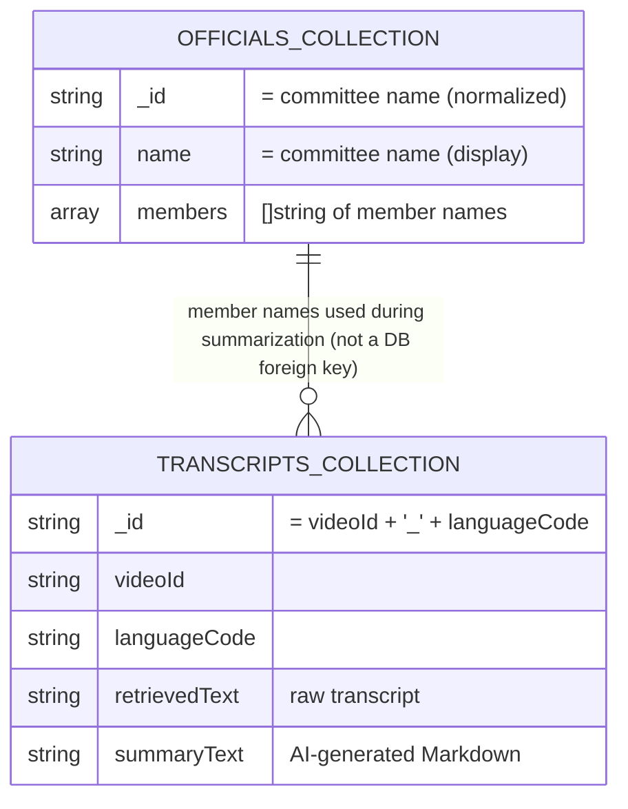
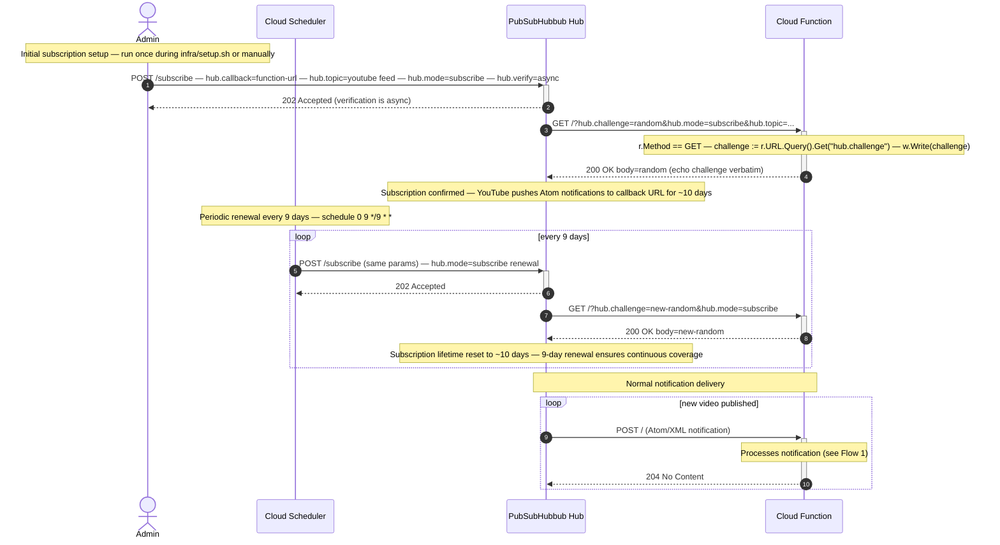
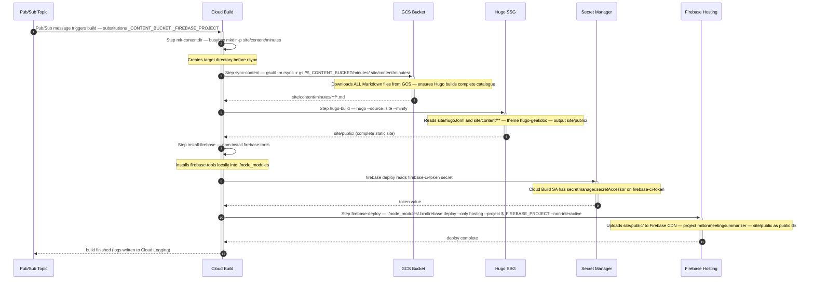

# C4 Level 4 — Code-Level Flows

This document contains detailed sequence diagrams for each major code path in the system. Each diagram shows the exact function calls, data transformations, and decision points involved.

Diagrams use **Mermaid** and render natively in GitHub and VS Code.

---

## Flow 1: Webhook Event → Transcription → Site Rebuild

This is the primary event-driven path. It starts when YouTube publishes a new meeting video and ends with the updated site deployed to Firebase Hosting.

```mermaid
sequenceDiagram
    autonumber
    actor Hub as YouTube PubSubHubbub Hub
    participant Fn as Cloud Function
    participant DB as Firestore
    participant YT as YouTube Data API v3
    participant TR as Transcript Provider
    participant AI as OpenAI API
    participant GCS as GCS Bucket
    participant PS as Pub/Sub Topic
    participant FB as Facebook Graph API
    participant CB as Cloud Build
    participant FH as Firebase Hosting

    Hub->>+Fn: POST /  (Atom/XML; hub.secret not verified)
    Note over Fn: xml.NewDecoder.Decode — extract channelId, videoId

    Fn->>+DB: ListPlaylists(ctx, client, channelId)
    Note over DB: collection playlists, filter by channelId
    DB-->>-Fn: []*Playlist (pageToken, numEntries per playlist)

    loop for each playlist
        Note over Fn: startToken = pl.PageToken if numEntries >= PLAYLIST_SCAN_THRESHOLD (100), else ""

        Fn->>+YT: ScanPlaylist(playlistId, startToken, pageSize=50)
        Note over YT: GET playlistItems.list — paginate until NextPageToken empty — sort by PublishedAt asc
        YT-->>-Fn: []*PlaylistEntry (Video + PageToken per entry)

        loop for each PlaylistEntry
            Fn->>+DB: GetVideo(ctx, client, videoId)
            DB-->>-Fn: error (not found) or existing Video

            alt video already in Firestore
                Note over Fn: skip — idempotency guard
            else video is new
                Fn->>+Fn: pipeline.Run(ctx, facade, client, video)

                Note over Fn: pkg/pipeline/pipeline.go

                Fn->>+TR: NewVideoTranscriber().Transcribe(ctx, videoId)
                Note over TR: provider selected by TRANSCRIPT_PROVIDER env var

                alt TranscriptAPI (primary)
                    TR->>TR: GET transcriptapi.com/api/v2/youtube/transcript — Bearer TRANSCRIPTAPI_API_KEY — retry <=3 on 408/429/503
                else Supadata (fallback)
                    TR->>TR: GET api.supadata.ai/v1/transcript — x-api-key SUPADATA_API_KEY — 200=sync, 202=poll jobId at 1s
                else YouTube direct (last resort)
                    TR->>TR: GET youtube.com/watch?v=videoId — extract ytInitialPlayerResponse — download caption XML
                end

                alt ErrTranscriptUnavailable (404 from provider)
                    TR-->>Fn: ErrTranscriptUnavailable
                    Note over Fn: InsertVideo with description="Transcript unavailable" — return nil, skip Facebook
                else transcript fetched
                    TR-->>-Fn: text string, languageCode string

                    Fn->>+DB: ListOfficialNames(ctx, client)
                    Note over DB: collection officials — flat []string of all member names across all committees
                    DB-->>-Fn: []string names (or nil on soft failure)

                    Fn->>+DB: GetTranscript(ctx, client, videoId, lang)
                    DB-->>-Fn: existing *Transcript or error (not found)

                    alt transcript not in Firestore
                        Fn->>+DB: InsertTranscript(ctx, client, transcript)
                        DB-->>-Fn: ok

                        Fn->>+AI: Summarize(ctx, text, names)
                        Note over AI: POST api.openai.com/v1/chat/completions — model gpt-4.1-mini — Auth CHATGPT_API_KEY
                        AI-->>-Fn: summaryText (Markdown)

                        Fn->>+DB: UpdateTranscript(ctx, client, transcript with summaryText)
                        Note over DB: $set summaryText
                        DB-->>-Fn: ok
                    else transcript exists
                        Note over Fn: use existing summaryText
                    end

                    Note over Fn: writeMarkdown — /tmp/hugo-content/minutes/YYYY/Month/videoId.md

                    Fn->>+GCS: uploadToGCS(bucket, hugoContentDir, mdPath)
                    Note over GCS: PUT gs://bucket/minutes/YYYY/Month/videoId.md — storage.objectCreator role
                    GCS-->>-Fn: ok

                    Fn->>+PS: publishBuildTrigger(ctx, videoId)
                    Note over PS: Publish JSON build trigger — pubsub.publisher role
                    PS-->>-Fn: ok

                    alt FACEBOOK_ENABLED != false AND credentials set
                        Fn->>+FB: PostToPage(pageId, token, post)
                        Note over FB: FormatPost — Markdown to plain text — POST graph.facebook.com/v22.0/pageId/feed
                        FB-->>-Fn: ok
                    end

                    Fn->>+DB: InsertVideo(ctx, client, video)
                    Note over DB: collection videos — _id = videoId
                    DB-->>-Fn: ok

                    Note over Fn: successCount++ — update pl.PageToken, pl.NumEntries

                    Fn->>+DB: UpdatePlaylist(ctx, client, pl)
                    Note over DB: $set pageToken, numEntries, updatedAt
                    DB-->>-Fn: ok
                end

                Fn-->>-Fn: pipeline.Run returns

                alt failCount >= MAX_PIPELINE_FAILURES (3)
                    Note over Fn: circuit breaker tripped — stop processing
                end
            end
        end
    end

    alt successCount > 0
        Note over Fn: pipeline.WriteAllMarkdown — re-renders all videos, re-uploads to GCS, publishes videoId="all"
        Fn->>DB: ListAllVideos(ctx, client)
        DB-->>Fn: []*Video
        loop for each video with summary
            Fn->>DB: ListTranscripts(ctx, client, videoId)
            DB-->>Fn: []*Transcript
            Fn->>GCS: uploadToGCS (re-upload)
        end
        Fn->>PS: publishBuildTrigger(ctx, "all")
    end

    Fn-->>Hub: 204 No Content (always; YouTube must not retry)

    Note over PS,CB: Cloud Build triggered by Pub/Sub message

    PS-->>+CB: Pub/Sub message triggers build

    CB->>CB: busybox mkdir -p site/content/minutes
    CB->>GCS: gsutil -m rsync -r gs://bucket/minutes/ site/content/minutes/
    GCS-->>CB: all Markdown files synced

    CB->>CB: hugo --source=site --minify
    Note over CB: reads site/content/minutes/**/*.md — generates site/public/

    CB->>CB: npm install firebase-tools

    CB->>+FH: firebase deploy --only hosting --project miltonmeetingsummarizer
    Note over FH: deploys site/public/ to Firebase CDN — firebase-ci-token from Secret Manager
    FH-->>-CB: deploy complete

    CB-->>-PS: build finished
```

### Key Decision Points

| Decision | Location | Behavior |
|---|---|---|
| `hub.challenge` GET vs notification POST | [handler.go:30](../../pkg/webhook/handler.go#L30) | GET echoes challenge; POST runs pipeline |
| Playlist start position | [handler.go:109](../../pkg/webhook/handler.go#L109) | Uses `pageToken` if `numEntries >= PLAYLIST_SCAN_THRESHOLD` |
| Video already processed | [handler.go:122](../../pkg/webhook/handler.go#L122) | `GetVideo` returns no error → skip |
| Transcript unavailable | [pipeline.go:58](../../pkg/pipeline/pipeline.go#L58) | Record video, return nil, skip Facebook |
| Transcript exists in DB | [pipeline.go:105](../../pkg/pipeline/pipeline.go#L105) | Skip API call; use stored `summaryText` |
| Circuit breaker | [handler.go:128](../../pkg/webhook/handler.go#L128) | Stop after `MAX_PIPELINE_FAILURES` failures |
| Facebook disabled | [pipeline.go:154](../../pkg/pipeline/pipeline.go#L154) | `FACEBOOK_ENABLED=false` skips posting |

---

## Flow 2: Playlist Retrieval

Playlists are managed in two distinct sub-flows: (A) initial population by an admin using `cmd/syncplaylists`, and (B) runtime scanning of playlist items during the webhook handler.

### Flow 2A: Playlist Sync (Admin Tool)

This admin tool is run once per year when YouTube channel playlists roll over to a new year. It populates the Firestore `playlists` collection that the webhook handler depends on.



### Flow 2B: Runtime Playlist Scanning (Webhook Handler)

During each webhook invocation, the handler scans each registered playlist for videos that haven't been processed yet. This flow covers the playlist scanning portion of the webhook handler.



### Playlist State Machine

The `pageToken` and `numEntries` fields in each playlist record track scanning progress:

```mermaid
stateDiagram-v2
    [*] --> Empty: cmd/syncplaylists upserts playlist; pageToken="", numEntries=0

    Empty --> Scanning: webhook fires, numEntries < 100; scan from beginning

    Scanning --> PartialProgress: pipeline.Run succeeds; UpdatePlaylist sets pageToken and numEntries

    PartialProgress --> Scanning: next webhook fires with numEntries >= 100; resume from saved pageToken

    PartialProgress --> FullyCovered: all new videos processed; pageToken near end of playlist

    FullyCovered --> Scanning: new video added; webhook fires; ScanPlaylist finds new items
```



---

## Flow 3: Officials Name Retrieval

Official names are used during summarization to improve spelling accuracy. This flow has two parts: the admin tool that populates the data, and the pipeline's runtime lookup.

### Flow 3A: Admin Tool — Scrape and Store Officials

```mermaid
sequenceDiagram
    autonumber
    actor Admin
    participant Cmd as cmd/officials
    participant Scraper as officials DOM parser
    participant LLM as officials LLM parser
    participant OpenAI as OpenAI API
    participant DB as Firestore (officials)

    Admin->>+Cmd: make officials  (or go run ./cmd/officials)
    Note over Cmd: Reads MONGODB_URI from env — context timeout 60 seconds

    Cmd->>+Scraper: officials.Fetch(ctx, nil)
    Note over Scraper: HTTP GET https://www.miltonma.gov/890/Town-Wide — User-Agent transcriptsummarizer/1.0
    Scraper-->>-Cmd: htmlBody string

    Cmd->>+Scraper: officials.ParseTownWideDOM(strings.NewReader(html))
    Note over Scraper: Walk HTML tree — collectTabNames finds committee names — extractMembers finds h4.widgetTitle or h3.subhead2

    alt DOM parse succeeds (normal path)
        Scraper-->>-Cmd: []Committee with Name and Members
    else DOM parse fails (page structure changed)
        Note over Cmd: Manual fallback — create LLMExtractor — requires CHATGPT_API_KEY
        Cmd->>+LLM: extractor.ParseTownWideLLM(ctx, htmlBody)
        LLM->>+OpenAI: POST chat/completions — model gpt-4.1-mini — ResponseFormat JSON — extract committees from HTML
        OpenAI-->>-LLM: JSON with committees array
        LLM->>LLM: json.Unmarshal — normalizeCommitteeName — collapseWhitespace on member names
        LLM-->>-Cmd: []Committee
    end

    Note over Cmd: Print all committees and members to stdout for review

    alt MONGODB_URI set
        Cmd->>+DB: col.Drop(writeCtx)
        Note over DB: Drops entire officials collection — Firestore MongoDB compat lacks BulkWrite so drop-then-insert is used
        DB-->>-Cmd: ok

        Cmd->>+DB: col.InsertMany(writeCtx, docs)
        Note over DB: Each doc has _id=committeeName, name, members array
        DB-->>-Cmd: ok

        Note over Cmd: Logs "N committees written to meetingtranscripts.officials"
    else MONGODB_URI not set
        Note over Cmd: Logs "MONGODB_URI not set; skipping database write" — dry-run mode
    end

    Cmd-->>-Admin: done
```

### Flow 3B: Runtime Officials Lookup During Summarization

```mermaid
sequenceDiagram
    autonumber
    participant Pipeline as pkg/pipeline
    participant DB as Firestore (officials)
    participant AI as OpenAI API

    Note over Pipeline: Inside processTranscript() — after transcript stored, before Summarize()

    Pipeline->>+DB: db.ListOfficialNames(ctx, client)
    Note over DB: collection officials — Find all docs — flatten all Members into []string

    alt DB lookup succeeds
        DB-->>-Pipeline: []string names (e.g. Alice Brown, John Smith, ...)

        Pipeline->>+AI: Summarize(ctx, transcriptText, names)
        Note over AI: userPrompt includes "Ensure these names are spelled correctly: Alice Brown, John Smith, ..." — POST gpt-4.1-mini
        AI-->>-Pipeline: summaryText (Markdown with corrected names)

    else DB lookup fails or collection empty
        Note over DB: ListOfficialNames returns nil — soft failure, logged but not fatal
        DB-->>Pipeline: nil

        Pipeline->>+AI: Summarize(ctx, transcriptText, nil)
        Note over AI: userPrompt = base prompt only — no name correction — POST gpt-4.1-mini
        AI-->>-Pipeline: summaryText (Markdown; names may be misspelled)
    end
```

### Officials Data Model



---

## Flow 4: PubSubHubbub Subscription Lifecycle

This flow covers the subscription setup and periodic renewal that keeps the system receiving YouTube push notifications.



---

## Flow 5: Cloud Build — Hugo Site Pipeline

This flow details what happens inside Cloud Build once the Pub/Sub trigger fires.



---

## Error Handling Summary

| Error | Location | Handling |
|---|---|---|
| XML parse failure | [handler.go:39](../../pkg/webhook/handler.go#L39) | 400 Bad Request; YouTube may retry |
| Empty channelId in feed | [handler.go:46](../../pkg/webhook/handler.go#L46) | 204 No Content; log warning |
| No playlists for channel | [handler.go:88](../../pkg/webhook/handler.go#L88) | Return nil; not an error |
| Playlist scan API error | [handler.go:116](../../pkg/webhook/handler.go#L116) | Log and continue to next playlist |
| `ErrTranscriptUnavailable` | [pipeline.go:58](../../pkg/pipeline/pipeline.go#L58) | Record video as unavailable; skip Facebook; return nil |
| Transcript API error (non-404) | [pipeline.go:67](../../pkg/pipeline/pipeline.go#L67) | Return error; increment `failCount` |
| Officials lookup failure | [pipeline.go:77](../../pkg/pipeline/pipeline.go#L77) | Log; continue without names (soft failure) |
| OpenAI error | [pipeline.go:115](../../pkg/pipeline/pipeline.go#L115) | Return error; increment `failCount` |
| GCS upload failure | [pipeline.go:139](../../pkg/pipeline/pipeline.go#L139) | Log; skip Pub/Sub publish; continue |
| Pub/Sub publish failure | [pipeline.go:144](../../pkg/pipeline/pipeline.go#L144) | Log; continue |
| Facebook post failure | [pipeline.go:162](../../pkg/pipeline/pipeline.go#L162) | Log; continue (non-fatal) |
| Circuit breaker tripped | [handler.go:130](../../pkg/webhook/handler.go#L130) | Stop processing; return nil to YouTube |
| Any pipeline error to YouTube | [handler.go:53](../../pkg/webhook/handler.go#L53) | Always 204; YouTube must not retry |
